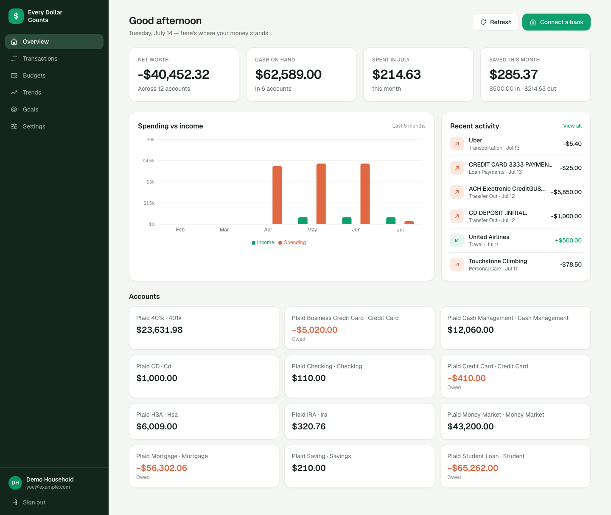

# Every Dollar Counts

A Mint-style budget tracker for a two-person household.

Mint shut down, and the replacements all wanted a subscription to show me my own bank balance. This does the handful of things I actually used: pull in transactions automatically, categorise them, set a few budgets, and track what we're saving toward. Nothing else.

**Live:** [every-dollar-counts.vercel.app](https://every-dollar-counts.vercel.app) — invite-only, since it's our household's money.



<sub>Running against Plaid's sandbox — every account above is a fake bank with fake transactions, and the household is a placeholder.</sub>

## What it does

- **Automatic bank sync** — link an account through Plaid; transactions and balances pull in on their own. The app never sees a bank password.
- **Dashboard** — net worth, cash on hand, what you've spent this month, and what you actually saved.
- **Transactions** — auto-categorised from Plaid's taxonomy, searchable, and re-categorisable when it guesses wrong.
- **Budgets** — a monthly limit per category, with bars that fill as you spend.
- **Trends** — where the money went, and how this month compares to last.
- **Savings goals** — set a target, track how close you are.
- **Shared** — both people in the household see the same data.

## Stack

Next.js 16 (App Router) · TypeScript · Tailwind CSS v4 · Supabase (Postgres + Auth) · Plaid · Recharts · Vercel

## How it works

```
Plaid  ──►  /api/plaid/sync-transactions  ──►  Supabase (Postgres)  ──►  Server Components
            (server-only, service_role)         row-level security        (read through RLS)
```

Every page is a Server Component reading straight from Postgres. There's no client-side data layer and no API for the browser to call to fetch its own data — the database decides what you're allowed to see, and the pages just render it.

A few decisions worth explaining:

- **Row-level security does the authorisation.** Every table is scoped to your household in Postgres, not in application code. The auth check in the proxy only saves you a redirect; it is not what keeps the data private. If the UI had a bug tomorrow, the database would still say no.
- **The Plaid access token is encrypted at rest** (AES-256-GCM) and lives in a table with RLS on and *no client policy at all* — it isn't reachable from the browser under any session. Only server-side code holding the service-role key can touch it.
- **Categories are household-owned, not hardcoded.** They start from Plaid's taxonomy, but you can rename, add, or delete them, and renames cascade everywhere.
- **Invite-only.** Signups are off; you get in only if your email is on the allowlist. Google SSO and magic links both pass through the same gate.

## Running it locally

You'll need a [Supabase](https://supabase.com) project and a [Plaid](https://plaid.com) account — the free sandbox is plenty, and it gives you fake banks with fake transactions to develop against.

```bash
git clone https://github.com/smilne3/every-dollar-counts.git
cd every-dollar-counts
npm install
cp .env.example .env.local   # then fill it in, see below
npm run dev
```

Apply the migrations in `db/migrations/` to your Supabase project in order, then seed a household:

```bash
node scripts/seed-household.mjs      # create a household + invite the first member
node scripts/seed-sandbox-bank.mjs   # link a Plaid sandbox bank with fake transactions
```

`.env.local` needs:

| variable | what it's for |
| --- | --- |
| `NEXT_PUBLIC_SUPABASE_URL` | your Supabase project URL |
| `NEXT_PUBLIC_SUPABASE_PUBLISHABLE_KEY` | Supabase publishable key (safe for the browser) |
| `SUPABASE_SERVICE_ROLE_KEY` | server-only; bypasses RLS for ingest and invites |
| `PLAID_CLIENT_ID` / `PLAID_SECRET` | Plaid credentials |
| `PLAID_ENV` | `sandbox` to start |
| `TOKEN_ENCRYPTION_KEY` | 32 bytes of hex — `openssl rand -hex 32` |

Never prefix a secret with `NEXT_PUBLIC_`; that ships it to the browser. `npm run check:secrets` guards against exactly that mistake.

```bash
npm test           # unit tests (Vitest)
npm run lint
npm run build
```

## Status

The v1 feature set is done and running on real infrastructure against Plaid's sandbox. Pointing it at real banks needs a Plaid production application, which is the next step.

Known gaps are tracked in [issues](https://github.com/smilne3/every-dollar-counts/issues). The honest ones: refunds are still counted as income, the transactions list silently caps at 200 rows, and there's no way to disconnect a bank yet.

## A note on how this was built

I'm a product manager, not an engineer. I built this with Claude Code to understand how the thing I write specs about every day actually gets made. The surprise was that the hard parts weren't the code — they were the decisions. What belongs in the database versus the application. What a confirmation dialog owes the person about to click it. How a chart can be technically correct and still lie to you.

A personal project, not affiliated with my employer.
